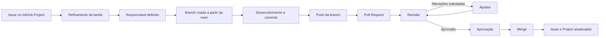

# Como contribuir e desenvolver neste projeto

Este documento define o fluxo de trabalho utilizado nos repositórios do Tirador de Pedidos do NEO.

O objetivo destas regras é manter o trabalho organizado, rastreável e compreensível para todos os integrantes, independentemente do time em que atuam.

As regras gerais deste documento devem ser seguidas por Produto, UI/UX, Frontend, Backend e Banco de Dados. Cada repositório poderá possuir orientações técnicas adicionais específicas da sua área.

---

## 1. Idioma e padronização técnica

As informações não técnicas como documentação, as discussões e os critérios de aceite serão escritos em português.

Os elementos técnicos do projeto deverão ser escritos em inglês, incluindo:

- nomes de branches;
- mensagens de commit;
- títulos de Pull Requests;
- nomes de arquivos e diretórios de código;
- variáveis;
- funções;
- classes;
- componentes;
- rotas;
- endpoints;
- tabelas;
- colunas e campos do banco de dados.

Exemplos:

```text
LoginForm.svelte
authService.ts
validateCorporateEmail()
requestStatus
createdAt
```

Evite misturar português e inglês dentro do código.

Exemplo inadequado:

```ts
const usuarioLogado = await authService.login();
```

Exemplo esperado:

```ts
const authenticatedUser = await authService.login();
```

---

## 2. Proteção da branch principal

A branch `main` representa a versão consolidada do projeto.

Embora o plano atual do GitHub não permita configurar uma proteção automática para os repositórios privados da organização, a `main` deverá ser tratada como uma branch protegida por todos os integrantes.

- Não realize push diretamente na `main`.
- Crie uma branch específica para cada tarefa.
- Vincule toda alteração a uma Issue.
- Caso a tarefa ainda não possua uma Issue, solicite sua criação ao líder do time pelo GitHub Project.
- Abra uma Pull Request para integrar qualquer alteração.
- Solicite a revisão de outro integrante.
- Não aprove o próprio Pull Request.
- Não realize o merge enquanto houver comentários ou solicitações de alteração pendentes.
- Atualize a documentação sempre que a mudança afetar regras, fluxos, decisões ou comportamento do projeto.

> **Importante:** não realize push diretamente na `main`.

---

## 3. Fluxo geral de contribuição

Toda alteração deve seguir o fluxo abaixo:



### Etapas do fluxo

1. Selecione uma Issue disponível no GitHub Project.
2. Confirme se a Issue possui objetivo, escopo, entregável e critérios de aceite.
3. Confirme se a tarefa está atribuída ao responsável correto.
4. Atualize sua branch local `main`.
5. Crie uma nova branch a partir da `main`.
6. Realize apenas as alterações relacionadas à Issue.
7. Faça commits pequenos durante o desenvolvimento.
8. Envie a branch para o repositório remoto.
9. Abra uma Pull Request vinculada à Issue.
10. Descreva a alteração e como ela pode ser validada.
11. Solicite a revisão de outro integrante.
12. Realize os ajustes solicitados, quando necessário.
13. Aguarde a aprovação.
14. Realize o merge.
15. Confirme se a Issue e o card do Project foram atualizados.

---

## 4. Antes de iniciar uma tarefa

Uma tarefa não deve ser iniciada apenas porque possui um título no GitHub Project.

Antes de começar, confirme se a Issue possui:

- contexto suficiente;
- objetivo claro;
- entregável definido;
- critérios de aceite verificáveis;
- time responsável;
- responsável pela execução;
- dependências conhecidas;
- prioridade definida;
- indicação da Sprint correspondente.

Caso alguma informação importante esteja ausente, converse com o líder do time antes de iniciar.

Uma Issue em `Backlog` ainda pode estar incompleta.

Uma Issue em `Ready` deve estar pronta para execução.

---

## 5. Atualização da branch `main`

Antes de criar uma nova branch, atualize sua versão local da `main`.

```bash
git switch main
git pull origin main
```

Depois, crie a branch da tarefa:

```bash
git switch -c feat/32-login-page
```

Não crie uma branch nova a partir de outra branch de funcionalidade, salvo quando isso tiver sido combinado previamente com o líder técnico.

O fluxo esperado é:

```text
origin/main
    │
    └── feat/32-login-page
```

Evite:

```text
origin/main
    │
    └── feat/20-home-page
            │
            └── feat/32-login-page
```

Branches encadeadas criam dependências desnecessárias e dificultam a integração.

---

## 6. Padrão de branches

Cada tarefa deve ser desenvolvida em uma branch própria.

O nome deve seguir o formato:

```text
type/issue-number-short-description
```

Tipos utilizados:

| Tipo | Uso |
|---|---|
| `feat` | Nova funcionalidade |
| `fix` | Correção de comportamento |
| `docs` | Criação ou atualização de documentação |
| `refactor` | Reorganização sem alteração intencional de comportamento |
| `chore` | Configuração, dependências ou manutenção |
| `style` | Ajustes exclusivamente visuais ou de formatação |

Exemplos:

```text
feat/32-login-page
feat/38-home-service-cards
fix/41-email-validation
docs/12-sprint-one-retrospective
refactor/57-login-form-components
chore/18-configure-frontend-lint
style/63-adjust-login-spacing
```

### Regras

- utilize letras minúsculas;
- escreva a descrição em inglês;
- separe palavras com hífens;
- inclua o número da Issue;
- mantenha o nome curto e objetivo;
- não use nomes de pessoas;
- não reutilize uma branch para outra tarefa.

Evite:

```text
andre-login
branch-nova
alteracoes
frontend
teste-login
```

---

## 7. Escopo das alterações

Uma branch e uma Pull Request devem tratar de uma única Issue ou de um único objetivo bem definido.

Evite misturar, na mesma Pull Request:

- implementação de tela;
- reorganização geral de pastas;
- atualização de dependências;
- alteração de documentação não relacionada;
- correção de outro problema encontrado durante o desenvolvimento.

Caso encontre outro problema, registre-o em uma nova Issue.

Exemplo:

Durante a implementação da tela de login, foi identificado um problema no componente de botão.

O esperado é:

1. registrar o problema;
2. criar ou solicitar uma nova Issue;
3. corrigir em outra branch, quando priorizado.

Isso mantém a revisão clara e reduz o risco de efeitos inesperados.

---

## 8. Padrão de commits

As mensagens de commit devem ser escritas em inglês.

Utilize o formato:

```text
type(scope): description
```

Exemplos:

```text
feat(auth): add login form
feat(home): add service access cards
fix(auth): validate corporate email
docs(sprint): document sprint one retrospective
refactor(login): extract password input component
chore(frontend): configure lint
style(login): adjust form spacing
```

### Tipos de commit

| Tipo | Uso |
|---|---|
| `feat` | Nova funcionalidade |
| `fix` | Correção |
| `docs` | Documentação |
| `refactor` | Reorganização interna |
| `chore` | Configuração e manutenção |
| `style` | Alteração visual ou de formatação |

### Escopo

O escopo indica a parte do projeto afetada.

Exemplos:

```text
auth
login
home
header
footer
requests
database
project
sprint
```

### Boas práticas

- faça commits pequenos;
- registre uma alteração coerente por commit;
- escreva a descrição no modo imperativo;
- utilize uma mensagem clara e específica;
- evite commits que misturem assuntos diferentes;
- revise os arquivos adicionados antes do commit.

Evite:

```text
updates
changes
adjustments
fix stuff
final version
now it works
commit 2
```

Uma boa mensagem permite compreender a alteração sem abrir os arquivos.

---

## 9. Frequência dos commits

Não é necessário criar um commit para cada linha alterada, mas também não espere concluir toda a tarefa para criar um único commit enorme.

Exemplo de evolução adequada:

```text
feat(login): add login page structure
feat(login): add form fields
feat(login): add password visibility control
fix(login): adjust corporate email validation
style(login): match prototype spacing
```

Cada commit deve representar um ponto lógico do desenvolvimento.

Antes de realizar um commit, verifique:

```bash
git status
git diff
```

Depois:

```bash
git add .
git commit -m "feat(login): add login form fields"
```

---

## 10. Envio da branch

No primeiro envio da branch:

```bash
git push -u origin feat/32-login-page
```

Nos próximos envios:

```bash
git push
```

Antes de abrir a Pull Request, confira:

- se todos os arquivos necessários foram enviados;
- se não há arquivos temporários;
- se nenhum dado sensível foi incluído;
- se a branch está relacionada à Issue correta.

---

## 11. Pull Requests

A Pull Request representa a solicitação formal de integração de uma alteração à `main`.

Ela deve possuir:

- título claro;
- descrição do que foi alterado;
- Issue relacionada;
- instruções de validação;
- evidências, quando aplicável;
- indicação de riscos ou limitações conhecidas.

O título deve seguir o mesmo padrão dos commits:

```text
feat(auth): implement login page
```

Outros exemplos:

```text
feat(home): implement main page
docs(sprint): document sprint one
fix(auth): correct email validation
refactor(login): extract reusable form components
```

### Antes de abrir a Pull Request

O autor deve:

- revisar o próprio código ou documento;
- conferir o diff completo;
- confirmar se os critérios de aceite foram atendidos;
- remover logs e comentários temporários;
- remover arquivos adicionados por engano;
- executar as validações disponíveis;
- atualizar a documentação necessária;
- incluir evidências da entrega;
- confirmar que nenhuma informação restrita foi exposta.

---

## 12. Pull Request em rascunho

Quando a alteração ainda estiver em desenvolvimento, mas precisar de orientação antecipada, poderá ser aberta uma Draft Pull Request.

Uma Draft Pull Request pode ser utilizada para:

- apresentar uma estrutura inicial;
- solicitar orientação técnica;
- discutir componentização;
- validar uma abordagem;
- sinalizar que a implementação ainda não está pronta para merge.

Ela não deve ser aprovada ou integrada enquanto estiver marcada como Draft.

Quando a implementação estiver pronta, altere o status para `Ready for review`.

---

## 13. Tamanho das Pull Requests

Pull Requests menores são mais fáceis de compreender, revisar e corrigir.

Uma Pull Request pode estar grande demais quando:

- altera muitas áreas diferentes;
- possui vários objetivos;
- exige muito tempo para compreender;
- contém arquivos sem relação entre si;
- mistura funcionalidade, refatoração e configuração;
- possui uma descrição difícil de resumir.

Caso isso aconteça, avalie dividir o trabalho em Issues menores.

O objetivo não é criar a menor Pull Request possível, mas evitar alterações excessivamente amplas e difíceis de revisar.

---

## 14. Revisão de código e documentação

Nenhum integrante deve aprovar o próprio Pull Request.

O revisor deve analisar:

### Escopo

- a alteração corresponde à Issue?
- foram incluídas mudanças sem relação com a tarefa?
- os critérios de aceite foram atendidos?

### Clareza

- o código ou documento está compreensível?
- os nomes utilizados são claros?
- as responsabilidades estão bem separadas?
- existem duplicações desnecessárias?

### Integração

- a alteração pode afetar outras partes do projeto?
- existe risco de quebrar um fluxo já existente?
- o Frontend e o Backend continuam utilizando contratos compatíveis?
- a alteração do banco foi alinhada com o Backend?

### Validação

- a alteração foi executada localmente?
- o lint foi executado, quando disponível?
- o typecheck foi executado, quando disponível?
- a evidência apresentada corresponde ao resultado esperado?
- os cenários de erro aplicáveis foram considerados?

### Documentação

- as regras afetadas foram atualizadas?
- o README precisa ser alterado?
- existe alguma decisão que precisa ser registrada?
- as instruções de execução continuam corretas?

---

## 15. Padrão dos comentários de revisão

Os comentários devem ser objetivos, respeitosos e indicar claramente o nível de importância.

Utilize os seguintes prefixos:

### `[BLOCKER]`

Problema que precisa ser corrigido antes do merge.

Exemplo:

```text
[BLOCKER] The form submits without validating the corporate email.
This does not meet the acceptance criteria.
```

### `[SUGGESTION]`

Melhoria recomendada, mas que não impede necessariamente o merge.

Exemplo:

```text
[SUGGESTION] Consider extracting this field into a reusable component,
because the same structure will be used in other forms.
```

### `[QUESTION]`

Dúvida sobre a decisão ou implementação.

Exemplo:

```text
[QUESTION] Is this validation expected to happen only in the frontend,
or will the backend validate it as well?
```

### `[NIT]`

Pequeno ajuste de nomenclatura, formatação ou legibilidade.

Exemplo:

```text
[NIT] This variable could be named `corporateEmail` for consistency.
```

### `[PRAISE]`

Reconhecimento de uma boa decisão.

Exemplo:

```text
[PRAISE] Good separation between the form state and the API request.
```

Comentários de revisão não devem atacar a pessoa que realizou a alteração.

Evite:

```text
Você fez isso errado.
Esse código está ruim.
Não era para fazer assim.
```

Prefira:

```text
[BLOCKER] This implementation allows an invalid email to be submitted.
Please validate the field before calling the authentication service.
```

---

## 16. Resposta aos comentários

O autor da Pull Request deve responder aos comentários de revisão.

Quando realizar uma alteração, informe o que foi modificado.

Exemplo:

```text
Adjusted in commit abc123. The email is now validated before submission.
```

Caso discorde de uma sugestão, explique o motivo de forma objetiva.

Não marque uma conversa como resolvida sem:

- realizar o ajuste solicitado; ou
- chegar a um acordo com o revisor.

---

## 17. Validações do projeto

O escopo atual não exige testes automatizados.

Entretanto, toda alteração deve possuir alguma evidência de validação.

### Documentação

- leitura e revisão por outro integrante;
- links válidos;
- estrutura Markdown correta;
- informações consistentes.

### UI/UX

- navegação do protótipo;
- comparação com o fluxo definido;
- revisão dos estados;
- validação do handoff.

### Frontend

- execução local;
- comparação com o protótipo;
- validação de responsividade;
- navegação por teclado;
- estados de erro e carregamento;
- lint, quando configurado;
- typecheck, quando configurado;
- build, quando configurado.

### Backend

- execução local;
- chamadas realizadas por cliente HTTP;
- validação de entradas;
- tratamento de erros;
- documentação do contrato;
- lint, quando configurado;
- typecheck, quando configurado.

### Banco de Dados

- migration executada;
- estrutura criada corretamente;
- seed executado, quando aplicável;
- nomes e relacionamentos revisados;
- validação conjunta com o Backend.

A ausência de testes automatizados não elimina a necessidade de validar o trabalho entregue.

---

## 18. Evidências

Sempre que aplicável, inclua evidências na Pull Request.

Exemplos:

- captura de tela;
- vídeo curto;
- GIF da navegação;
- resposta de uma requisição;
- trecho de log;
- diagrama;
- link para o Figma;
- instruções de reprodução;
- resultado do lint;
- resultado do typecheck;
- resultado do build.

Não inclua:

- credenciais;
- tokens;
- dados reais do cliente;
- informações classificadas como restritas;
- capturas que exponham dados sensíveis.

---

## 19. Merge

O merge somente poderá ser realizado quando:

- a Pull Request estiver pronta para revisão;
- os critérios de aceite tiverem sido atendidos;
- outro integrante tiver revisado;
- não houver comentários pendentes;
- as validações aplicáveis tiverem sido executadas;
- a documentação necessária estiver atualizada;
- não houver conflitos com a `main`.

Utilize preferencialmente:

```text
Squash and merge
```

O squash mantém a `main` com um histórico mais limpo, reunindo os commits da Pull Request em uma única entrada.

O título final do merge deve continuar seguindo o padrão:

```text
feat(auth): implement login page
```

---

## 20. Atualização do Project

Após o merge:

1. confirme se a Issue foi concluída;
2. atualize o status do card para `Done`;
3. adicione o link da Pull Request como evidência;
4. registre pendências que não foram resolvidas;
5. crie novas Issues para trabalhos identificados durante a execução.

Uma Pull Request integrada não significa automaticamente que todo o épico foi concluído.

O card deve refletir o estado real do trabalho.

---

## 21. Bloqueios

Caso não consiga avançar em uma tarefa:

1. registre o bloqueio na Issue;
2. atualize o status no GitHub Project;
3. descreva o motivo;
4. informe qual ajuda é necessária;
5. comunique o líder do time.

Exemplo:

```markdown
## Blocker

The frontend integration is waiting for the authentication contract from the backend team.

Required action: define the request and response formats for the login endpoint.
```

Não espere a reunião seguinte para comunicar um impedimento crítico.

---

## 22. Informações restritas

Este projeto utiliza documentação classificada como restrita.

Não inclua no repositório:

- credenciais;
- tokens;
- arquivos `.env`;
- dados pessoais reais;
- dados corporativos não autorizados;
- documentos restritos completos;
- informações que não sejam necessárias para o desenvolvimento.

Utilize arquivos como:

```text
.env.example
```

para documentar nomes de variáveis sem expor valores reais.

Antes de fazer um commit, revise os arquivos adicionados:

```bash
git status
git diff --staged
```

Em caso de dúvida, não realize o push e consulte o líder responsável.

---

## 23. Responsabilidades

### Autor da alteração

- compreender a Issue;
- respeitar o escopo;
- manter a branch atualizada;
- criar commits claros;
- validar o próprio trabalho;
- documentar a alteração;
- responder às revisões.

### Revisor

- compreender os critérios de aceite;
- avaliar o conteúdo da alteração;
- comunicar problemas com clareza;
- diferenciar bloqueios de sugestões;
- validar novamente após os ajustes.

### Líder do time

- garantir que as Issues estejam refinadas;
- orientar decisões técnicas ou funcionais;
- distribuir revisões;
- identificar bloqueios;
- manter o backlog atualizado.

### Scrum Master

- facilitar o fluxo;
- acompanhar impedimentos;
- manter o processo visível;
- promover alinhamento entre os times;
- garantir que decisões e entregas sejam registradas.

---

## 24. Resumo operacional

```text
Issue
  ↓
Confirmar escopo e critérios de aceite
  ↓
Atualizar main
  ↓
Criar branch
  ↓
Desenvolver
  ↓
Criar commits pequenos
  ↓
Executar validações
  ↓
Abrir Pull Request
  ↓
Solicitar revisão
  ↓
Corrigir blockers
  ↓
Obter aprovação
  ↓
Squash and merge
  ↓
Atualizar Issue e Project
```

Em caso de dúvida sobre o processo, consulte o líder do seu time antes de prosseguir.
