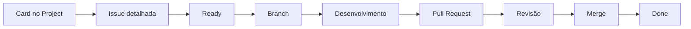

# Padrão de Issues

Este documento define como as Issues devem ser criadas, detalhadas, acompanhadas e concluídas no projeto Tirador de Pedidos do NEO.

As Issues representam unidades de trabalho. Elas devem deixar claro o que precisa ser feito, por que a tarefa existe, quem é responsável, quais são as dependências e como a entrega será validada.

O GitHub Project é a fonte oficial para acompanhar o andamento das tarefas. A maior parte das Issues será criada ou organizada diretamente pelo board do projeto.

---

## 1. Finalidade

Uma Issue pode representar:

- funcionalidade;
- correção;
- atividade de Produto;
- entrega de UI/UX;
- implementação de Frontend;
- implementação de Backend;
- alteração no banco de dados;
- documentação;
- decisão;
- atividade de Coordenação.

Uma Issue não deve ser apenas um lembrete genérico. Ela precisa possuir informações suficientes para orientar a execução e permitir a validação.

---

## 2. Fluxo



O GitHub Project mostra o estado geral do trabalho.

A Issue concentra contexto, objetivo, escopo, critérios de aceite, dependências, decisões, bloqueios, referências e evidências.

A branch contém as alterações da tarefa.

A Pull Request apresenta a entrega para revisão e integração à `main`.

---

## 3. Quando criar uma Issue

Crie uma Issue quando o trabalho:

- precisa ser atribuído;
- será acompanhado no Project;
- possui um entregável identificável;
- precisa de critérios de aceite;
- depende de outro time ou atividade;
- poderá gerar branch ou Pull Request;
- deve permanecer registrado no histórico.

Atividades pequenas e inseparáveis podem permanecer como checklist de uma Issue maior.

Não crie uma nova Issue para cada ação mínima. Também não reúna entregas grandes e independentes em uma única Issue.

---

## 4. Título

Formato recomendado:

```text
ÁREA — Ação e resultado esperado
```

Exemplos:

```text
FRONTEND — Implementar formulário da tela de login
BACKEND — Criar endpoint de autenticação
BANCO DE DADOS — Modelar entidade de usuário
UI/UX — Documentar estados da tela de login
PRODUTO — Definir regras de autenticação do MVP
COORDENAÇÃO — Documentar retrospectivamente a Sprint 1
```

Evite títulos como:

```text
Fazer login
Ajustes
Tela
Ver backend
Resolver banco
```

---

## 5. Estrutura recomendada

```markdown
## Contexto

Explique por que esta tarefa existe.

## Objetivo

Descreva o resultado esperado.

## Escopo

### Incluído

- 
- 

### Não incluído

- 
- 

## Entregável

Informe o que deverá existir ao final.

## Critérios de aceite

- [ ] 
- [ ] 
- [ ] 

## Dependências

- Nenhuma; ou
- Issue:
- Time:
- Documento:
- Decisão:

## Referências

- Figma:
- Documentação:
- Protótipo:
- Discussão:
- Outro:

## Evidências esperadas

Informe como a entrega será demonstrada ou validada.

## Observações

Registre riscos, restrições ou informações adicionais.
```

O nível de detalhe deve ser proporcional à complexidade e ao risco da tarefa.

---

## 6. Contexto

O contexto deve explicar:

- por que a tarefa é necessária;
- qual problema ou necessidade ela atende;
- qual parte do projeto será afetada;
- quais decisões anteriores estão relacionadas.

Exemplo:

```markdown
## Contexto

A Sprint 2 prevê a implementação da tela de login apresentada no
protótipo de alta fidelidade. O Frontend precisa da estrutura visual
antes da integração com a API de autenticação.
```

---

## 7. Objetivo

O objetivo descreve o resultado, não apenas uma sequência de ações.

Exemplo:

```markdown
## Objetivo

Disponibilizar a estrutura responsiva da tela de login em Svelte,
seguindo o protótipo aprovado e permitindo a interação com os campos
de e-mail e senha.
```

---

## 8. Escopo

O escopo estabelece os limites da tarefa.

Exemplo:

```markdown
## Escopo

### Incluído

- estrutura visual da tela;
- campos de e-mail e senha;
- controle para exibir ou ocultar a senha;
- comportamento responsivo.

### Não incluído

- autenticação real;
- persistência de sessão;
- recuperação de senha;
- integração corporativa.
```

Não aumente o escopo durante a execução sem alinhamento.

---

## 9. Entregável

O entregável informa o que deverá existir ao final.

Exemplos:

- tela implementada;
- componente reutilizável;
- endpoint disponível;
- migration criada;
- modelo de dados documentado;
- protótipo navegável;
- regra definida;
- documento revisado;
- decisão registrada.

---

## 10. Critérios de aceite

Os critérios devem ser:

- objetivos;
- verificáveis;
- relacionados ao escopo;
- compreensíveis para autor e revisor;
- compatíveis com o escopo atual.

Exemplo:

```markdown
## Critérios de aceite

- [ ] A tela segue o protótipo aprovado.
- [ ] Os campos de e-mail e senha podem ser preenchidos.
- [ ] O usuário pode exibir e ocultar a senha.
- [ ] O layout funciona em desktop e mobile.
- [ ] A aplicação executa localmente.
```

Evite:

```text
Ficar bonito.
Funcionar direito.
Estar completo.
```

A Issue só deve ir para `Ready` quando atender à [`Definition of Ready`](./definition-of-ready.md).

---

## 11. Dependências e referências

Dependências podem envolver:

- outra Issue;
- outro time;
- protótipo;
- regra de negócio;
- contrato de API;
- modelagem de dados;
- decisão técnica;
- acesso ou configuração.

Quando não houver, registre:

```text
Nenhuma dependência conhecida.
```

As referências podem incluir Figma, documentos, Issues, Pull Requests, diagramas, contratos e decisões.

Não inclua documentos restritos completos quando uma referência controlada for suficiente.

---

## 12. Evidências esperadas

### Produto

- documento revisado;
- regra registrada;
- decisão aprovada;
- critérios atualizados.

### UI/UX

- link para Figma;
- protótipo navegável;
- capturas dos estados;
- handoff atualizado.

### Frontend

- capturas;
- vídeo ou GIF;
- instruções de execução;
- lint, typecheck ou build, quando disponíveis.

### Backend

- requisição e resposta;
- logs;
- contrato documentado;
- instruções de reprodução;
- lint ou typecheck, quando disponíveis.

### Banco de Dados

- diagrama;
- migration;
- schema resultante;
- evidência de execução;
- validação com Backend.

### Coordenação

- documento;
- checklist;
- cronograma;
- registro de reunião;
- links para PRs.

---

## 13. Campos do Project

Sempre que disponíveis, preencha:

- status;
- time;
- responsável;
- prioridade;
- Sprint;
- tipo de trabalho;
- dependências ou bloqueio.

A Issue explica o trabalho. Os campos do Project permitem organizar e filtrar.

---

## 14. Status

### Backlog

A necessidade foi registrada, mas ainda pode precisar de refinamento ou decisão.

### Ready

A Issue atende à Definition of Ready e pode ser iniciada.

### In progress

Existe alguém trabalhando ativamente.

### In review

A entrega está em revisão ou validação.

### Blocked

A tarefa não pode avançar por causa de um impedimento.

### Done

A entrega atende à Definition of Done e foi integrada ou formalmente concluída.

---

## 15. Atualização e bloqueios

Durante a execução, registre na Issue:

- decisões;
- dúvidas que afetam o escopo;
- bloqueios;
- mudanças alinhadas;
- links para branches;
- links para Pull Requests;
- evidências;
- pendências encontradas.

Modelo de bloqueio:

```markdown
## Bloqueio

**Motivo:** o Frontend ainda não possui o contrato da resposta de login.

**Impacto:** a integração com a API não pode ser concluída.

**Ação necessária:** Backend e Frontend devem definir o formato da
requisição e da resposta.

**Responsável pelo alinhamento:** líderes de Frontend e Backend.
```

---

## 16. Divisão de Issues

Divida uma Issue quando:

- possuir entregas independentes;
- envolver vários times com trabalho separável;
- não couber dentro da Sprint;
- gerar PRs grandes;
- possuir critérios de aceite muito diferentes;
- parte do trabalho puder ser priorizada separadamente.

Exemplo:

```text
Issue principal — Implementar autenticação inicial

├── Produto — Definir regras do login
├── UI/UX — Documentar estados da tela
├── Frontend — Implementar tela de login
├── Backend — Criar endpoint de autenticação
└── Banco de Dados — Modelar usuário
```

---

## 17. Relação com branches e PRs

Uma Issue pode estar relacionada a várias branches e Pull Requests.

Uma Issue maior pode receber vários PRs:

```text
Issue — Estruturar documentação inicial

├── PR — Adicionar CONTRIBUTING.md
├── PR — Adicionar Definition of Ready e Definition of Done
└── PR — Adicionar padrões de Issues e Pull Requests
```

Um PR integrado não significa que toda a Issue maior foi concluída.

---

## 18. Conclusão

Antes de mover para `Done`, confirme:

- critérios de aceite atendidos;
- entregável produzido;
- revisão concluída;
- evidências registradas;
- documentação atualizada;
- PR integrada, quando aplicável;
- Project atualizado;
- pendências registradas separadamente.

A conclusão deve seguir a [`Definition of Done`](./definition-of-done.md).

---

## 19. Exemplo completo

```markdown
# FRONTEND — Implementar formulário da tela de login

## Contexto

A Sprint 2 prevê a implementação da homepage e da tela de login com
base no protótipo de alta fidelidade.

## Objetivo

Implementar em Svelte o formulário responsivo da tela de login.

## Escopo

### Incluído

- campo de e-mail;
- campo de senha;
- controle de visibilidade da senha;
- opção de lembrar acesso;
- botão de entrada;
- comportamento responsivo.

### Não incluído

- autenticação real;
- sessão;
- recuperação de senha;
- integração corporativa.

## Entregável

Formulário disponível no repositório de Frontend e executável localmente.

## Critérios de aceite

- [ ] O formulário segue o protótipo.
- [ ] Os campos podem ser preenchidos.
- [ ] A senha pode ser exibida e ocultada.
- [ ] O layout funciona em desktop e mobile.
- [ ] O código utiliza nomes em inglês.
- [ ] A aplicação executa localmente.
- [ ] A alteração foi revisada.

## Dependências

- Protótipo da tela de login.
- Estrutura inicial do projeto Svelte.

## Evidências esperadas

- captura em desktop;
- captura em mobile;
- instruções de execução;
- Pull Request relacionada.
```

---

## 20. Resumo operacional

```text
Criar ou detalhar Issue
        ↓
Definir objetivo, escopo e critérios
        ↓
Preencher campos do Project
        ↓
Validar Definition of Ready
        ↓
Mover para Ready
        ↓
Criar branch e executar
        ↓
Atualizar decisões e bloqueios
        ↓
Abrir Pull Request
        ↓
Registrar revisão e evidências
        ↓
Validar Definition of Done
        ↓
Mover para Done
```
