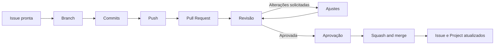

# Padrão de Pull Requests

Este documento define como as Pull Requests devem ser abertas, descritas, revisadas e integradas nos repositórios do projeto Tirador de Pedidos do NEO.

A Pull Request é a solicitação formal para integrar uma alteração à branch `main`. Ela também registra o que foi modificado, por que a mudança foi necessária, como o resultado pode ser validado e quais decisões foram tomadas durante a revisão.

---

## 1. Finalidade

Uma Pull Request deve permitir que outra pessoa compreenda e revise a alteração sem depender de explicações privadas.

Ela deve responder:

- qual necessidade está sendo atendida;
- qual Issue está relacionada;
- o que foi alterado;
- o que não faz parte da entrega;
- como validar;
- quais impactos ou limitações existem;
- quais evidências foram apresentadas;
- se a alteração está pronta para integração.

A Pull Request não deve ser tratada apenas como um botão para realizar o merge.

---

## 2. Fluxo



---

## 3. Quando abrir

Abra uma Pull Request quando:

- a branch estiver no repositório remoto;
- existir uma Issue relacionada;
- o escopo principal estiver concluído;
- as validações disponíveis tiverem sido executadas;
- o autor tiver revisado o próprio trabalho;
- houver informação suficiente para orientar o revisor.

Use Draft Pull Request quando precisar validar uma abordagem, discutir estrutura ou antecipar risco antes da conclusão.

Uma Draft não está pronta para aprovação ou merge.

---

## 4. Relação com Issues

Toda Pull Request deve indicar uma Issue principal.

Uma Issue pode possuir vários PRs quando a entrega for realizada em partes.

Como o fechamento será manual neste momento, não utilizar:

```text
Closes #123
```

Use:

```markdown
## Issue relacionada

Issue principal: #123

Issues relacionadas:

- Nenhuma; ou
- #124
```

Após o merge, atualize manualmente a Issue e o Project.

---

## 5. Título

O título deve seguir o seguinte padrão:

```text
type(scope): description
```

| Tipo | Uso |
|---|---|
| `feat` | Nova funcionalidade |
| `fix` | Correção |
| `docs` | Documentação |
| `refactor` | Reorganização sem mudança intencional de comportamento |
| `chore` | Configuração, dependências ou manutenção |
| `style` | Alteração exclusivamente visual ou de formatação |

Exemplos:

```text
feat(login): implement login form
feat(home): add service access cards
fix(auth): validate corporate email
docs(workflow): add issue and pull request standards
refactor(login): extract password field component
chore(frontend): configure lint
style(home): adjust card spacing
```

---

## 6. Idioma

### Em inglês

- código;
- arquivos e diretórios técnicos;
- branches;
- commits;
- títulos de Pull Requests;
- variáveis;
- funções;
- classes;
- componentes;
- rotas;
- tabelas e campos.

### Em português

- descrição da Pull Request;
- instruções de validação;
- discussão;
- comentários de revisão;
- critérios de aceite;
- documentação de gestão.

---

## 7. Escopo e tamanho

Cada PR deve representar uma alteração específica e coerente.

Evite misturar:

- funcionalidades diferentes;
- correções não relacionadas;
- reorganização geral;
- dependências sem relação;
- documentação de outro assunto;
- alterações independentes em várias áreas.

Uma PR pode estar grande demais quando:

- possui vários objetivos;
- altera muitas partes independentes;
- contém arquivos sem relação clara;
- é difícil resumir;
- mistura funcionalidade, refatoração e configuração;
- exige muito tempo apenas para compreender o contexto.

Não existe limite obrigatório de linhas. Avalie clareza e coesão.

---

## 8. Revisão do próprio trabalho

Antes de solicitar revisão:

```bash
git status
git diff
```

Confira também o diff no GitHub.

Verifique:

- arquivos relacionados à tarefa;
- ausência de arquivos acidentais;
- remoção de logs e comentários temporários;
- ausência de credenciais;
- nomes em inglês;
- documentação atualizada;
- critérios de aceite atendidos;
- validações executadas.

---

## 9. Modelo de descrição

Enquanto não houver automação, copie este modelo:

```markdown
## Resumo

Descreva brevemente o que foi alterado e por que a mudança foi necessária.

## Alterações realizadas

- 
- 
- 

## Issue relacionada

Issue principal: #

Issues relacionadas:

- Nenhuma; ou
- #

## Escopo não incluído

- Nenhum; ou
- 
- 

## Como validar

1. 
2. 
3. 

## Evidências

Adicione capturas, vídeos, links, respostas da API, logs, diagramas
ou outras evidências aplicáveis.

## Impactos, dependências e limitações

Descreva impactos sobre outros fluxos ou times, dependências e
limitações conhecidas.

Caso não existam:

Nenhum impacto, dependência ou limitação conhecida.

## Checklist do autor

- [ ] Revisei minhas próprias alterações.
- [ ] A alteração atende aos critérios de aceite.
- [ ] O PR está limitado ao escopo da Issue.
- [ ] Removi arquivos, logs e comentários temporários.
- [ ] Executei as validações disponíveis.
- [ ] Adicionei evidências quando aplicável.
- [ ] Atualizei a documentação necessária.
- [ ] Não incluí credenciais, dados sensíveis ou informações restritas.
- [ ] O PR está pronto para revisão.
```

---

## 10. Como preencher

### Resumo

Explique o propósito da alteração em poucas frases.

### Alterações realizadas

Liste mudanças relevantes, sem reproduzir cada linha ou arquivo.

### Escopo não incluído

Registre o que ficou fora quando houver risco de dúvida.

### Como validar

Forneça passos reproduzíveis.

Exemplo de Frontend:

```markdown
1. Execute a aplicação.
2. Acesse `/login`.
3. Verifique desktop e mobile.
4. Preencha os campos.
5. Exiba e oculte a senha.
```

Exemplo de Backend:

```markdown
1. Execute a API.
2. Envie `POST /api/auth/login`.
3. Valide uma entrada correta.
4. Valide uma entrada inválida.
```

Exemplo de documentação:

```markdown
1. Leia o documento completo.
2. Verifique os links internos.
3. Confirme a coerência com o CONTRIBUTING.md.
4. Confirme a aplicabilidade aos cinco times.
```

---

## 11. Evidências

### Produto

- documento;
- decisão;
- critérios;
- link para discussão.

### UI/UX

- Figma;
- capturas;
- vídeo;
- protótipo navegável.

### Frontend

- capturas desktop e mobile;
- vídeo ou GIF;
- instruções de execução;
- lint, typecheck ou build, quando disponíveis.

### Backend

- requisição e resposta;
- logs;
- contrato;
- instruções;
- lint ou typecheck, quando disponíveis.

### Banco de Dados

- migration;
- diagrama;
- schema;
- evidência de execução;
- validação com Backend.

### Documentação e Coordenação

- arquivos;
- links;
- checklist;
- diagrama;
- registro revisado.

Não inclua credenciais, tokens, dados pessoais reais ou informações restritas.

---

## 12. Impactos, dependências e limitações

Informe:

- mudança de contrato entre times;
- dependência de migration;
- funcionalidade simulada;
- comportamento ainda não implementado;
- impacto em outro fluxo;
- necessidade de alteração em outro repositório;
- decisão provisória do MVP.

Exemplo:

```markdown
A tela utiliza dados simulados. A integração com o endpoint de login
será realizada em outra Issue após a definição do contrato da API.
```

---

## 13. Draft Pull Request

Use Draft quando o trabalho ainda estiver incompleto.

Exemplo:

```markdown
## Estado atual

Este PR está em rascunho.

Pendências:

- [ ] concluir responsividade;
- [ ] alinhar contrato com Backend;
- [ ] adicionar evidências;
- [ ] executar validações.
```

Quando estiver pronto:

1. conclua as pendências;
2. revise o diff;
3. atualize a descrição;
4. altere para `Ready for review`;
5. solicite revisor.

---

## 14. Escolha do revisor

O autor não deve aprovar o próprio PR.

Preferências:

- alteração técnica: integrante ou líder do time;
- contrato entre áreas: representantes dos times envolvidos;
- Produto: responsável de Produto;
- UI/UX: integrante de UI/UX e, quando aplicável, Produto ou Frontend;
- banco: Banco de Dados e Backend;
- documentação geral: líder ou Scrum Master diferente do autor.

Uma PR pode ter mais de um revisor.

---

## 15. Responsabilidades

### Autor

- compreender a Issue;
- respeitar o escopo;
- manter a descrição atualizada;
- validar o trabalho;
- fornecer evidências;
- responder aos comentários;
- realizar ajustes;
- avisar quando estiver pronto;
- não realizar merge com pendências.

### Revisor

Verificar:

- aderência à Issue;
- critérios de aceite;
- clareza;
- escopo;
- integração com outras áreas;
- validações;
- documentação;
- ausência de credenciais e dados restritos.

---

## 16. Comentários de revisão

Os comentários podem ser escritos em português.

### `[BLOCKER]`

Precisa ser corrigido antes do merge.

```text
[BLOCKER] O formulário permite envio com o e-mail vazio, mas esse
comportamento não atende ao critério de aceite.
```

### `[SUGGESTION]`

Melhoria recomendada.

```text
[SUGGESTION] Considere extrair este campo para um componente
reutilizável.
```

### `[QUESTION]`

Dúvida necessária para compreender a decisão.

```text
[QUESTION] Esta validação deve ocorrer apenas no Frontend ou também
no Backend?
```

### `[NIT]`

Pequeno ajuste de nomenclatura ou legibilidade.

```text
[NIT] O nome `corporateEmail` manteria a consistência.
```

### `[PRAISE]`

Reconhecimento de uma boa decisão.

```text
[PRAISE] A separação do estado do formulário deixou o fluxo mais claro.
```

Comente sobre a alteração, não sobre a pessoa.

---

## 17. Resposta aos comentários

Quando ajustar:

```text
Ajustado no commit abc123. A validação agora ocorre antes do envio.
```

Quando discordar, explique objetivamente.

Não resolva uma conversa sem:

- realizar o ajuste; ou
- chegar a um acordo com o revisor.

Os novos commits devem ser enviados para a mesma branch:

```bash
git add .
git commit -m "fix(login): validate email before submission"
git push
```

---

## 18. Validações esperadas

O escopo atual não exige testes automatizados.

### Frontend

- execução local;
- comparação com protótipo;
- responsividade;
- interações;
- estados aplicáveis;
- lint, typecheck e build, quando disponíveis.

### Backend

- execução local;
- requisições manuais;
- validação de entradas;
- tratamento de erros;
- contrato;
- lint e typecheck, quando disponíveis.

### Banco de Dados

- migration;
- schema;
- seed, quando aplicável;
- validação com Backend.

### Documentação

- leitura;
- links;
- Markdown;
- coerência;
- revisão.

### Produto e UI/UX

- fluxo;
- requisitos;
- protótipo;
- estados;
- handoff.

A ausência de testes automatizados não elimina a necessidade de validar.

---

## 19. Aprovação e merge

Uma PR pode ser aprovada quando:

- atende aos critérios;
- respeita o escopo;
- possui descrição suficiente;
- apresenta validação e evidências;
- não contém blockers;
- não expõe informação restrita;
- está pronta para integração.

O merge só deve ocorrer quando:

- não estiver em Draft;
- houver revisão de outro integrante;
- houver aprovação;
- não existirem comentários pendentes;
- não houver conflito com a `main`;
- a documentação estiver atualizada.

Utilize preferencialmente:

```text
Squash and merge
```

O título final deve continuar seguindo:

```text
type(scope): description
```

---

## 20. Depois do merge

1. remova a branch, quando apropriado;
2. atualize a Issue;
3. registre o link do PR;
4. atualize o Project;
5. mova para `Done` somente após atender à Definition of Done;
6. registre pendências em novas Issues.

Um PR integrado não conclui automaticamente uma Issue maior com outras entregas pendentes.

---

## 21. Exemplo completo

```markdown
# feat(login): implement login form

## Resumo

Implementa a estrutura inicial da tela de login em Svelte com base no
protótipo aprovado para a Sprint 2.

## Alterações realizadas

- cria a rota da tela;
- adiciona os campos de e-mail e senha;
- adiciona o controle de visibilidade da senha;
- implementa responsividade;
- separa componentes reutilizáveis.

## Issue relacionada

Issue principal: #32

Issues relacionadas:

- #28

## Escopo não incluído

- autenticação real;
- sessão;
- recuperação de senha;
- integração corporativa.

## Como validar

1. Execute o Frontend.
2. Acesse `/login`.
3. Verifique desktop e mobile.
4. Preencha os campos.
5. Exiba e oculte a senha.
6. Confirme que a aplicação executa sem erros.

## Evidências

- captura desktop;
- captura mobile;
- vídeo curto da interação.

## Impactos, dependências e limitações

A autenticação ainda é simulada. A integração com o Backend será feita
em outra Issue.

## Checklist do autor

- [x] Revisei minhas próprias alterações.
- [x] A alteração atende aos critérios de aceite.
- [x] O PR está limitado ao escopo.
- [x] Removi arquivos temporários.
- [x] Executei as validações.
- [x] Adicionei evidências.
- [x] Atualizei a documentação.
- [x] Não incluí informações restritas.
- [x] O PR está pronto para revisão.
```

---

## 22. Resumo operacional

```text
Concluir alteração
        ↓
Revisar diff
        ↓
Executar validações
        ↓
Fazer push
        ↓
Abrir PR
        ↓
Relacionar Issue
        ↓
Preencher descrição e evidências
        ↓
Solicitar revisão
        ↓
Responder comentários
        ↓
Corrigir blockers
        ↓
Obter aprovação
        ↓
Squash and merge
        ↓
Atualizar Issue e Project
```
