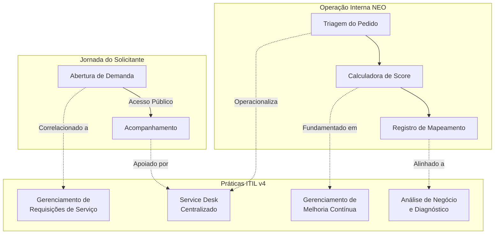

# Diretrizes de Governança de Serviços de TI — Alinhamento ITIL v4

---

## 1. Introdução e Justificativa de Governança

O **Tirador de Pedidos NEO** atua como o ponto único de entrada para requisições de melhorias e automações operacionais no Núcleo de Eficiência Operacional. O objetivo deste documento é consolidar as diretrizes funcionais e terminologias de mercado herdadas da biblioteca de melhores práticas **ITIL v4** (_Information Technology Infrastructure Library_), aplicando-as de forma leve ao ciclo de vida das solicitações do NEO.

Diferente de softwares de ITSM tradicionais (como o GLPI) que sobrecarregam o usuário final com taxonomias complexas, telas poluídas e burocracia excessiva, o **Tirador de Pedidos NEO** adota uma postura ágil e focada em valor. O alinhamento com o ITIL v4 serve para:

1. **Elevar a maturidade operacional** do time do NEO sem comprometer a simplicidade do MVP.
2. **Garantir conformidade e rastreabilidade** em auditorias externas de governança de TI corporativa, utilizando termos reconhecidos globalmente.
3. **Formalizar papéis operacionais e de liderança** no fluxo, permitindo que a transição de responsabilidades ocorra sem gargalos ou conflitos de custódia.

---

## 2. Mapeamento do Fluxo do NEO vs. Práticas ITIL v4

O fluxo macro do Tirador de Pedidos NEO (Acesso -> Abertura -> Triagem -> Priorização -> Mapeamento -> Encerramento) está formalmente correlacionado a práticas estruturadas do ITIL v4. Esta correlação garante que cada funcionalidade da plataforma responda a um propósito de governança claro.

### 2.1. Abertura de Solicitação Pública $\rightarrow$ Prática: Gerenciamento de Requisições de Serviço (_Service Request Management_)

A jornada inicia-se no formulário público estruturado em blocos de dados. No ITIL v4, uma **Requisição de Serviço** é um pedido de um usuário para iniciar uma ação de serviço (neste caso, uma melhoria ou automação operacional).

- **Aplicação Prática no NEO:** A abertura pública livre elimina a necessidade de autenticação prévia (sem senhas para o MVP), agilizando o ponto de contato inicial.
- **Dados Coletados:** Estrutura-se no fornecimento de dados divididos em Blocos: Identificação (quem pede), Identificação da Demanda (o que pede), Informações Operacionais (métricas de esforço e frequência) e Informações Complementares.
- **Valor de Governança:** Garante a padronização na entrada de dados, forçando o solicitante a detalhar o processo atual, sistemas envolvidos e volumetria aproximada antes que a demanda seja analisada.

### 2.2. Acompanhamento e Triagem $\rightarrow$ Prática: Central de Serviços (_Service Desk_)

A triagem atua como o filtro centralizado das demandas que chegam à fila do NEO. A Central de Serviços, segundo o ITIL v4, é o ponto de comunicação entre o provedor de serviços e seus usuários.

- **Aplicação Prática no NEO:** O painel público de acompanhamento por chave dupla de validação (Protocolo + E-mail) fornece visibilidade em tempo real ao Solicitante sobre pendências abertas, data prevista de mapeamento e status, mantendo dados confidenciais (comentários internos e score de prioridade) protegidos e privados.
- **Módulo Administrativo:** A Fila Centralizada consolida as demandas e permite ao Analista realizar buscas rápidas e avaliações de elegibilidade.

### 2.3. Mapeamento de Processos $\rightarrow$ Prática: Análise de Negócio (_Business Analysis_)

No ITIL v4, a prática de Análise de Negócio foca na identificação e definição de soluções para problemas de negócios de maneira a maximizar o valor entregue às partes interessadas.

- **Aplicação Prática no NEO:** Representado pelo fluxo de **Registro de Mapeamento**. Como o sistema atua como um repositório declarativo, o analista realiza as reuniões externamente (Teams/Outlook) e registra os dados de diagnósticos e alinhamentos na plataforma, utilizando templates dinâmicos de e-mail integrados à área de transferência para otimizar o tempo operacional de comunicação.

### 2.4. Priorização de Demandas $\rightarrow$ Prática: Gerenciamento de Melhoria Contínua (_Continual Improvement_) e Gerenciamento de Portfólio

O ITIL v4 posiciona a Melhoria Contínua como uma prática vital para manter os serviços eficientes. O repositório de demandas do NEO atua conceitualmente como o **Registro de Melhoria Contínua (CIR - Continual Improvement Register)** corporativo, centralizando todas as propostas de otimização de fluxos de trabalho da organização.

- **Aplicação Prática no NEO:** A **Calculadora de Score por Média Ponderada** quantifica objetivamente a relevância de cada demanda com base em critérios de negócio estruturados, fornecendo prioridades automáticas e auditáveis.

---

## 3. Gestão de Melhoria Contínua: Critérios e Calculadora de Score

Para que a triagem não dependa de percepções puramente subjetivas da equipe técnica, a calculadora de score operacionaliza o alinhamento estratégico e a análise de valor preconizados pelo ITIL v4. O score de 10 a 50 pontos classifica as solicitações automaticamente em faixas fixas de classificação (Baixa, Média, Alta ou Crítica).

A tabela abaixo correlaciona os **10 critérios de negócio da calculadora do NEO** com os pilares conceituais do ITIL v4 para demonstrar como o algoritmo reflete a geração de valor operacional.

| Critério de Negócio do NEO  | Pontuação (1 a 5) | Peso Padrão | Pilar Conceitual ITIL v4    | Justificativa de Alinhamento de Governança                                                                                |
| :-------------------------- | :---------------: | :---------: | :-------------------------- | :------------------------------------------------------------------------------------------------------------------------ |
| **Alinhamento Estratégico** |       1 a 5       |      1      | Co-criação de Valor         | Avalia se a automação ou melhoria apoia diretamente os objetivos estratégicos anuais da corporação.                       |
| **Impacto Operacional**     |       1 a 5       |      1      | Eficiência e Utilidade      | Mede a abrangência e relevância das melhorias propostas na rotina produtiva diária dos colaboradores.                     |
| **Impacto no Cliente**      |       1 a 5       |      1      | Foco no Valor (End-User)    | Verifica o nível de benefício final ou percepção de valor gerado para o cliente externo da Toyota/NEO.                    |
| **Volumetria**              |       1 a 5       |      1      | Otimização e Automação      | Quantifica a escala de repetição do processo analisado (número de transações ou registros processados/mês).               |
| **Esforço Manual**          |       1 a 5       |      1      | Eliminação de Desperdício   | Avalia a carga horária de trabalho manual rotineiro que atualmente é despendida pela equipe do solicitante.               |
| **Urgência**                |       1 a 5       |      1      | Gestão de Portfólio e Tempo | Determina a janela de oportunidade ou necessidade temporal de atendimento antes de afetar as operações.                   |
| **Prazo Regulatório**       |       1 a 5       |      1      | Riscos e Conformidade       | Pondera se a ausência da melhoria gera multas, inconformidades contratuais ou riscos regulatórios.                        |
| **Risco Operacional**       |       1 a 5       |      1      | Gestão de Riscos            | Mede a probabilidade de ocorrência de erros graves, fraudes ou retrabalhos caso o processo permaneça como está.           |
| **Áreas Impactadas**        |       1 a 5       |      1      | Integração Organizacional   | Avalia a quantidade de departamentos ou filiais diferentes que se beneficiarão diretamente da entrega.                    |
| **Complexidade Estimada**   |       1 a 5       |      1      | Custos e Viabilidade        | Funciona como o moderador técnico. Um processo extremamente complexo exige mais esforço e reduz o retorno de curto prazo. |

---

## 4. Matriz RACI de Responsabilidades (Alinhamento ITIL)

Para eliminar conflitos de responsabilidade e estabelecer uma linha clara de prestação de contas, a matriz **RACI** (_Responsible, Accountable, Consulted, Informed_) abaixo define o papel de cada perfil operacional do NEO em cada etapa crítica do ciclo de vida.

- **R - Responsible (Executor):** Quem executa diretamente a tarefa.
- **A - Accountable (Responsável Final/Aprovador):** Quem responde pela decisão e possui autoridade final de aprovação (somente uma pessoa por atividade).
- **C - Consulted (Consultado):** Quem fornece informações, pareceres ou insumos vitais para a execução da tarefa.
- **I - Informed (Informado):** Quem precisa ser atualizado sobre os resultados ou status da atividade.

### Matriz de Papéis do NEO

| Etapa Operacional / Atividade                   |    Solicitante     | Analista / Mapeador | Administrador do NEO | Gestor / Visualizador | Admin Root (Técnico) |
| :---------------------------------------------- | :----------------: | :-----------------: | :------------------: | :-------------------: | :------------------: |
| **Abertura de nova solicitação**                |   **A** / **R**    |          I          |          I           |           I           |          I           |
| **Triagem e análise de elegibilidade**          |         I          |        **R**        |        **A**         |           I           |          I           |
| **Avaliação e cálculo do Score de Prioridade**  |         I          |        **R**        |        **A**         |           I           |          I           |
| **Definição/Atribuição de Responsável Técnico** |         I          |          I          |    **A** / **R**     |           I           |          I           |
| **Agendamento e registro do Mapeamento**        |         C          |        **R**        |        **A**         |           I           |          I           |
| **Alteração de Status das Demandas**            |         I          | **R** (com limites) |  **A** (irrestrito)  |           I           |          I           |
| **Edição de Categorias e Parâmetros globais**   |         I          |          I          |    **A** / **R**     |           I           |          I           |
| **Criação de Contas de Usuários**               |         I          |          I          |        **R**         |           I           |        **A**         |
| **Visualização de KPIs e Relatórios**           | I (apenas próprio) | **R** (atribuídas)  |    **R** (total)     |     **R** (total)     |          I           |
| **Consulta de Histórico de Auditoria**          | I (apenas próprio) |        **C**        |    **A** / **R**     |           I           |          I           |

---

## 5. Nomenclatura e Status de Ciclo de Vida (17 Status) para Auditoria e Conformidade

A matriz de status do NEO possui **17 status funcionais** que garantem a micro-rastreabilidade de cada demanda do MVP. Para garantir a governança e permitir auditorias de TI externas sem poluir o acompanhamento visual do Solicitante, os status internos do NEO são correlacionados ao **Ciclo de Vida de Ciclo Único de ITIL v4**.

A tabela abaixo descreve essa equivalência de nomenclatura corporativa.

| Status no NEO                       | Categoria / Estado ITIL v4 Equivalente            | Descrição Operacional e Gatilhos de Mudança                                                        | Visibilidade do Solicitante |
| :---------------------------------- | :------------------------------------------------ | :------------------------------------------------------------------------------------------------- | :-------------------------: |
| **1. Solicitação enviada**          | _Submitted_ (Submetida)                           | Demanda persistida no banco pelo solicitante. Aguarda geração física de protocolo.                 |             Sim             |
| **2. Aguardando triagem**           | _Queued_ (Em Fila de Entrada)                     | Inserida de forma automática na Fila Centralizada à espera de triagem.                             |             Sim             |
| **3. Em triagem**                   | _Under Assessment_ (Sob Avaliação)                | Analista abre os detalhes para iniciar a avaliação. O sistema dispara esse status.                 |             Sim             |
| **4. Pendente de informações**      | _Pending User_ (Pendente com Usuário)             | Analista identifica falta de dados cruciais e envia notificação de pendência em tela.              |             Sim             |
| **5. Aguardando mapeamento**        | _Approved for Diagnostics_ (Diagnóstico Pendente) | Demanda aprovada na triagem. O Administrador define o técnico responsável.                         |             Sim             |
| **6. Mapeamento agendado**          | _Diagnostics Scheduled_ (Diagnóstico Agendado)    | Reunião de mapeamento de processos agendada formalmente fora da plataforma.                        |             Sim             |
| **7. Em mapeamento**                | _In Diagnostics_ (Diagnóstico em Execução)        | Reunião ou sessões de análise de processo estão ocorrendo na data agendada.                        |             Sim             |
| **8. Em análise de viabilidade**    | _Under Feasibility Study_ (Estudo de Viabilidade) | Equipe técnica do NEO avalia se o processo mapeado é passível de automação.                        |             Sim             |
| **9. Elegível**                     | _Qualified_ (Qualificada)                         | Demanda atende a todos os critérios operacionais e de escopo do NEO.                               |             Sim             |
| **10. Não elegível**                | _Ineligible_ (Não Qualificada)                    | Demanda rejeitada por estar fora do escopo ou sem viabilidade técnico-operacional.                 |             Sim             |
| **11. Priorizado**                  | _Prioritized in CIR_ (Oportunidade Priorizada)    | Score calculado coloca a solicitação em nível destacado para execução prioritária.                 |             Sim             |
| **12. Backlog**                     | _Backlog_ (Backlog Técnico)                       | Aprovada, porém retida no banco para aguardar alocação futura de capacidade técnica.               |             Sim             |
| **13. Direcionado para outra área** | _Transferred_ (Transferida)                       | Identificada como necessidade viável, mas que deve ser executada por outra célula ou time técnico. |             Sim             |
| **14. Em desenvolvimento**          | _Implementation_ (Em Execução de Solução)         | O desenvolvimento da automação ou melhoria foi iniciado (Scripts, fluxos, robôs RPA).              |             Sim             |
| **15. Em homologação**              | _Testing & Validation_ (Em Homologação)           | A solução está em fase de testes conjuntos e validação do usuário final na ponta.                  |             Sim             |
| **16. Concluído**                   | _Resolved & Closed_ (Concluída / Encerrada)       | Entrega finalizada de forma bem-sucedida, com resultados validados e documentados.                 |             Sim             |
| **17. Cancelado**                   | _Canceled_ (Cancelada)                            | Demanda cancelada internamente por duplicidade, descontinuidade do processo ou desistência.        |             Sim             |

---

## 6. Avaliação de Práticas ITIL Descartadas ou Simplificadas (Foco no MVP)

Para evitar que o Portal NEO herde as burocracias rígidas das ferramentas tradicionais de ITSM de mercado, várias práticas da biblioteca ITIL v4 foram intencionalmente **descartadas ou adaptadas com simplificação profunda** para o MVP. Essa modelagem garante conformidade sem onerar o time técnico e a interface do usuário.

#### Diretriz de Produto: "Herde a robustez do vocabulário do ITIL sem herdar a poluição de tela e complexidade do GLPI."

### 6.1. Habilitação de Mudanças (_Change Enablement_) $\rightarrow$ **Descartada / Simplificada**

- **A Prática Original:** Exige que qualquer alteração de sistema passe por um comitê formal de aprovação de mudanças (CAB - _Change Advisory Board_), testes exaustivos registrados, rollback estruturado e aprovações multifásicas.
- **Justificativa de Descarte para o NEO:** As demandas cadastradas no NEO são melhorias e automações operacionais em rotinas departamentais (ex: RPA ou scripts de simplificação). Submetê-las a um CAB corporativo engessaria a agilidade do núcleo. O controle de liberação fica restrito à etapa simples de **Homologação** (Status 15) executada diretamente entre o Analista e o Solicitante, mantendo o processo dinâmico.

### 6.2. Gerenciamento de Ativos e de Configuração (_Service Asset and Configuration Management - SACM_) $\rightarrow$ **Descartada**

- **A Prática Original:** Requer o registro e mapeamento de todos os itens de configuração (CI) físicos e lógicos (hardware, licenças de software, servidores) em um banco de dados de gerenciamento de configuração (CMDB).
- **Justificativa de Descarte para o NEO:** O escopo do NEO é focado em eficiência de processos de negócios e fluxos de automação de tarefas, não em inventário ou controle de hardware. Acoplar um banco de dados CMDB geraria complexidade técnica desnecessária no modelo de dados do banco PostgreSQL, exigindo o mapeamento de ativos que já são gerenciados por outras instâncias tradicionais da empresa.

### 6.3. Gerenciamento de Incidentes de Processo (_Incident Management_) $\rightarrow$ **Tratamento Simplificado**

- **A Prática Original:** Dedicada a restaurar a operação normal do serviço de TI o mais rápido possível após uma falha ou queda inesperada de sistema.
- **Justificativa de Descarte/Simplificação para o NEO:** O Tirador de Pedidos NEO **não é um sistema de suporte de infraestrutura ou suporte de TI geral** (como "problemas com internet" ou "troca de mouse"). Se uma automação existente apresentar problemas (um incidente), o solicitante pode reportar a necessidade como uma nova solicitação na categoria **Apoio Técnico**, **Revisão de Processo** ou **Outros**. Desta forma, o NEO trata o incidente conceitualmente sob o mesmo fluxo simplificado de requisição de serviço, centralizando e otimizando a fila operacional sem precisar de um módulo técnico separado para incidentes.

### 6.4. Gerenciamento de Nível de Serviço (_Service Level Management - SLM_) $\rightarrow$ **Simplificado para Alvos Operacionais**

- **A Prática Original:** Estabelece contratos rígidos de nível de serviço (SLA), com acordos formais tripartites de tempos de resposta, penalidades financeiras e painéis complexos de monitoramento de metas em tempo real.
- **Justificativa de Simplificação para o NEO:** O time técnico do NEO não atuará sob SLAs contratuais punitivos típicos de terceirizadas. Em vez disso, o MVP implementará **Alvos Operacionais de Entrega** visíveis apenas internamente como indicadores visuais (ex: atrasos, sem responsável, demandas fora do prazo ideal, tempo médio entre abertura e triagem). Isso elimina a poluição visual de contadores de tempo regressivos nas telas do Solicitante, que apenas geram ansiedade e ruído.

---

## 7. Rastreabilidade e Auditoria Imutável

O maior trunfo de governança do Tirador de Pedidos NEO é a imutabilidade do seu histórico de transações. Alinhado com as recomendações de segurança e auditorias corporativas, qualquer transição nos status operacionais, alterações de pesos ou atribuições gera um log de auditoria automático.

Este log protege a integridade das decisões tomadas na calculadora de score e na alocação de recursos:

- **Imutabilidade:** O histórico de auditoria não possui telas ou funcionalidades para exclusão através da interface comum.
- **Schema Estruturado:** Registra de forma indelével o protocolo, tipo de ação, usuário executor, timestamp exato, valores anteriores, novos valores e observações/justificativas associadas.
- **Valor de Auditoria:** Garante conformidade com órgãos externos e governança de TI interna ao comprovar matematicamente o porquê de uma melhoria ter sido priorizada ou rejeitada.

---

### Considerações Finais

O alinhamento conceitual contido neste documento garante que o Tirador de Pedidos NEO possua robustez técnica de grandes soluções corporativas sob um chassi ágil e simplificado de MVP.
