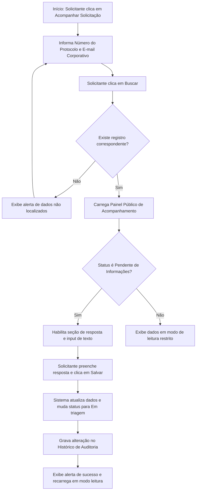

# Fluxo Funcional: Consulta de Solicitação

Este documento especifica o fluxo público que permite ao solicitante acompanhar o andamento da sua demanda no **Tirador de Pedidos do NEO** e sanar pendências solicitadas pela equipe técnica de análise.

## 1. Visão Geral do Fluxo

- **Objetivo:** Permitir que o solicitante acompanhe a evolução do status da sua demanda, visualize a data acordada para reuniões de mapeamento, verifique as pendências registradas pelo analista e complemente informações de forma direta e transparente.
- **Ator Principal:** Solicitante.
- **Condição Inicial:** Solicitante possui o número do protocolo único e o e-mail corporativo utilizado na abertura da demanda, acessando a área "Acompanhar Solicitação" no Portal público.

---

## 2. Sequência Principal de Passos

### Detalhamento dos Passos:

1.  **Acesso à Consulta:** O Solicitante acessa o portal público do NEO e entra em "Acompanhar Solicitação".
2.  **Identificação de Acesso:** O Solicitante insere o **Número do Protocolo** (ex: `NEO-2026-000102`) e o **E-mail Corporativo** associado na abertura.
3.  **Carregamento de Detalhes:** Se a validação do par de dados for bem-sucedida, o painel de acompanhamento público é carregado. O painel exibe estritamente as seguintes informações públicas do sistema:
    - _Número do Protocolo_ (Sempre visível).
    - _Nome da Demanda / Processo_ (Exibição resumida).
    - _Data de Abertura_.
    - _Status Público Atual_ (Mapeado conforme a matriz de status).
    - _Responsável Técnico do NEO_ (Nome visível quando permitido).
    - _Previsão ou Data de Mapeamento Confirmada_.
    - _Pendências destinadas ao solicitante_ (Exibe texto descritivo do que falta).
    - _Data e Horário da última atualização_.
    - _Próximo Passo_ (Instrução textual orientativa - ex: "Aguarde o contato do analista").
    - _Conclusão da Análise_ (Resultado final e justificativa de encerramento).
4.  **Bloqueio de Informações Internas:** O sistema realiza a filtragem de dados. **Comentários internos de analistas, notas de avaliação dos 10 critérios e scores de priorização não são visíveis ao solicitante sob nenhuma hipótese**.

---
