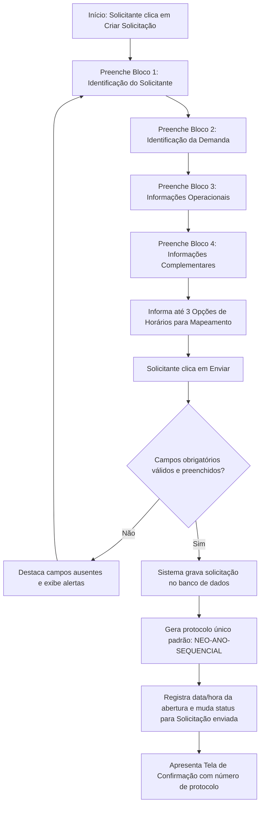

# Fluxo Funcional: Criação de Solicitação

Este documento especifica o fluxo público de abertura de demandas direcionadas ao **Núcleo de Eficiência Operacional (NEO)**. Ele garante a padronização e consistência dos dados inseridos, servindo como ponto de entrada único do sistema.

## 1. Visão Geral do Fluxo

- **Objetivo:** Permitir ao solicitante realizar o cadastro completo de uma demanda operacional, garantindo a captura das informações de identificação, operacionais e de negócio fundamentais para a triagem posterior.
- **Ator Principal:** Solicitante [53, 74].
- **Condição Inicial:** Solicitante acessa a URL pública do portal inicial do NEO e clica no botão "Criar Solicitação".

---

## 2. Sequência Principal de Passos

### Detalhamento dos Passos:

1.  **Acesso ao Formulário:** O Solicitante acessa o formulário de abertura que é estruturado em blocos de dados para garantir usabilidade.
2.  **Bloco 1: Identificação do Solicitante:** Preenchimento de dados de contato:
    - _Nome Completo_ (Obrigatório)
    - _E-mail Corporativo_ (Obrigatório; validação do domínio corporativo configurado)
    - _Área Solicitante_ (Obrigatório)
    - _Departamento_ (Opcional ou obrigatório de acordo com regras de parametrização)
    - _Gestor Responsável_ (Obrigatório, campo textual)
    - _Contato Adicional_ (Opcional)
3.  **Bloco 2: Identificação da Demanda:** Preenchimento de dados do processo do negócio:
    - _Nome do Processo_ (Obrigatório)
    - _Título Resumido da Solicitação_ (Obrigatório)
    - _Tipo de Solicitação_ (Obrigatório - ex: Automação, Melhoria, etc.)
    - _Categoria da Demanda_ (Obrigatório, selecionável via lista administrável de parâmetros)
    - _Descrição da Necessidade_ (Obrigatório, campo longo)
    - _Problema ou Oportunidade Identificada_ (Obrigatório)
    - _Resultado Esperado_ (Obrigatório)
    - _Justificativa da Solicitação_ (Obrigatório)
4.  **Bloco 3: Informações Operacionais:** Coleta de métricas e volumes reais para fundamentar a complexidade:
    - _Descrição resumida do processo atual_ (Obrigatório)
    - _Principais etapas do processo_ (Obrigatório)
    - _Sistemas utilizados_ (Obrigatório)
    - _Frequência de execução_ (Obrigatório)
    - _Volumetria aproximada_ (Obrigatório - ex: transações/mês)
    - _Quantidade de pessoas envolvidas_ (Obrigatório)
    - _Tempo médio de execução_ (Obrigatório)
    - _Esforço mensal estimado em horas_ (Obrigatório)
    - _Existência de controles manuais_ (Obrigatório)
    - _Principais riscos envolvidos_ (Obrigatório)
    - _Impacto no cliente final_ (Obrigatório)
    - _Impacto operacional para a área_ (Obrigatório)
    - _Prazo desejado pelo solicitante_ (Obrigatório)
    - _Criticidade percebida pelo solicitante_ (Obrigatório)
5.  **Bloco 4: Informações Complementares & Preferências:**
    - _Existência de documentação do processo_ (Sim/Não e detalhes)
    - _Existência de solução semelhante_ (Sim/Não e detalhes)
    - _Dependência de outras áreas_ (Sim/Não e detalhes)
    - _Tratamento de informações restritas ou sensíveis_ (Sim/Não)
    - _Observações adicionais_ (Opcional)
    - _Preferência de Horários para Mapeamento:_ O solicitante preenche obrigatoriamente **até três opções de datas/horários** de sua preferência para as sessões de mapeamento.
6.  **Gravação e Protocolo:** O sistema realiza a validação das regras. Uma vez validada, a solicitação é persistida, gera-se um protocolo de identificação única no padrão `NEO-{ANO}-{SEQUENCIAL}` (ex: `NEO-2026-000123`), com status inicial de **Solicitação enviada**.
7.  **Tela de Confirmação:** O sistema exibe de forma imediata a página de sucesso contendo o protocolo, data e hora do registro e orientações operacionais.

---

## 3. Decisões e Regras de Negócio Associadas

- **Validação de E-mail Corporativo:** O campo de e-mail deve aceitar apenas domínios validados (ex: `@toyota.com` ou `@neo.com`), disparando alerta front-end caso o formato seja inválido.
- **Geração Incremental Imutável:** O gerador de protocolo não deve falhar em caso de concorrência de requisições, utilizando bloqueio ou gerador atômico de numeração incremental por ano vigente.
- **Preferência de Horários Declarativa:** A captura das três opções de horários do solicitante é meramente declarativa (para contato de referência); nesta primeira versão do MVP, o sistema **não realiza consulta de agendas ou checagem de conflitos no Exchange/Outlook**.

---
