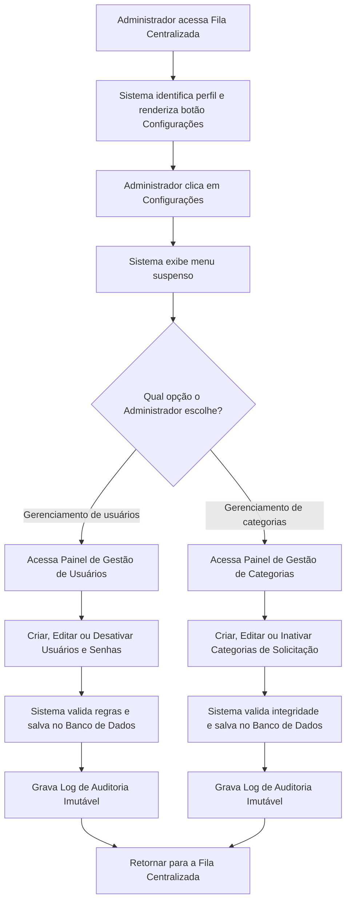

# Fluxo Funcional: Gerenciamento de Configurações e Parâmetros (Exclusivo Administrador)

Este documento detalha as especificações funcionais e o fluxo de navegação do painel de **Configurações e Parâmetros** do **Tirador de Pedidos do NEO**. Essa funcionalidade é restrita e destinada exclusivamente ao perfil de **Administrador** para garantir a governança e integridade operacional do sistema.

## 1. Visão Geral do Fluxo

- **Objetivo:** Permitir ao Administrador gerenciar de forma autônoma e centralizada os usuários do sistema, perfis de acesso e as categorias de solicitações, eliminando a necessidade de alterações manuais diretamente no código-fonte.
- **Ator:** Administrador.
- **Condição Inicial:** Administrador autenticado no sistema e posicionado na Fila Centralizada de Pedidos.

---

## 2. Sequência Principal de Passos

### Detalhamento dos Passos:

1.  **Exibição Condicional do Botão:** No cabeçalho da Fila Centralizada de Pedidos , o sistema detecta se o perfil do usuário logado é **Administrador**. Somente para este perfil, o botão **"configurações"** é renderizado dinamicamente em tela. Para os demais perfis (Analista e Gestor), o botão é completamente omitido por razões de segurança e usabilidade.
2.  **Abertura do Menu Suspenso:** Ao clicar no botão "configurações", o sistema abre um menu _popover_ contendo três opções operacionais:
    - **Gerenciamento de usuários**
    - **Gerenciamento de categorias**
3.  **Seleção e Execução de Operação:** O administrador escolhe o módulo que deseja alterar, executa as modificações em tela através de formulários estruturados, e o sistema processa as validações antes de persistir as mudanças no banco de dados.
4.  **Gravação do Histórico de Auditoria:** Qualquer ação de alteração, criação ou desativação de usuários ou categorias dispara automaticamente a geração de um registro no log imutável com a identificação do autor, tipo da ação, data/hora, valor anterior e valor novo.

---

## 3. Detalhamento Técnico das Operações

### A. Gerenciamento de Usuários e Perfis

Este módulo permite que o administrador controle de maneira autônoma as pessoas que operam o sistema administrativamente (Analistas, Administradores e Gestores).

- **Campos de Cadastro de Usuário:**
  - **Nome Completo:** Campo textual (Obrigatório).
  - **E-mail Corporativo:** Validação de formato de e-mail e unicidade no banco (Obrigatório). Funciona como login de acesso.
  - **Função/Perfil:** Seleção de perfil (_Analista_, _Administrador_ ou _Gestor_).
  - **Especialidades / Competências:** Campo de texto livre para mapear áreas de domínio do técnico.
  - **Categorias Atendidas:** Lista de seleção múltipla associada às categorias que o técnico é especialista.
  - **Status de Acesso:** Ativo ou Inativo.
  - **Capacidade de Atendimento:** Número indicativo (ex: limite de demandas paralelas que o usuário pode assumir).
  - **Senha de Acesso Local:** Campo para definição da senha inicial com regras de segurança (mínimo de 8 caracteres).
- **Ações Disponíveis:**
  - **Criar Novo Usuário:** Insere um novo registro com senha inicial de forma manual.
  - **Editar Cadastro:** Atualiza dados de especialidade, perfil, capacidade ou e-mail corporativo.
  - **Desativar Usuário:** Altera o status do usuário para "Inativo". **Atenção:** Usuários não devem ser excluídos fisicamente do banco de dados para evitar a perda do histórico de demandas que eles já atenderam no passado (preservando o log de auditoria).

### B. Gerenciamento de Categorias de Solicitação

Este módulo garante que as categorias nas quais as demandas são classificadas possam ser evoluídas ao longo do tempo.

- **Categorias Iniciais de Fábrica:** Automação, Melhoria de processo, Indicador, Dashboard ou relatório, Análise de dados, Padronização, Revisão de processo, Apoio técnico, Estudo de viabilidade, Outros.
- **Campos do Cadastro de Categorias:**
  - **Nome da Categoria:** Campo de texto livre e de valor único (Obrigatório).
  - **Descrição Orientativa:** Explicação rápida do propósito da categoria para orientar o preenchimento (Obrigatório).
- **Ações Disponíveis:**
  - **Criar Nova Categoria:** Cria uma nova opção de classificação em tempo de execução.
  - **Editar Categoria:** Altera o nome ou descrição de uma categoria existente.
  - **Inativar Categoria:** Desativa a categoria, impedindo que novos solicitantes a escolham no formulário de abertura.
