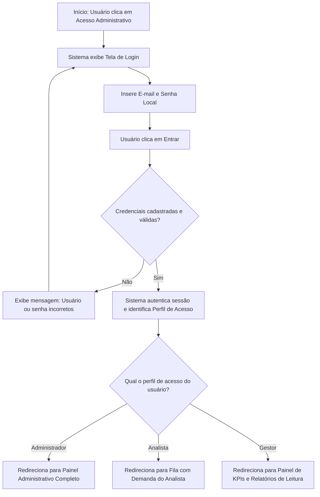
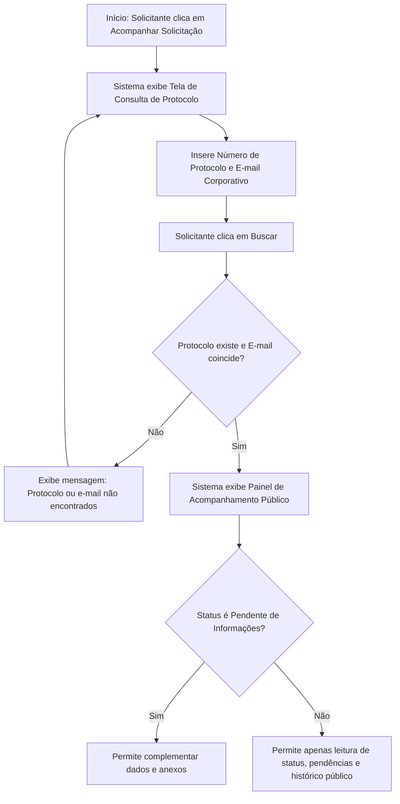

# Fluxo Funcional: Login e Perfis de Acesso

Este documento estabelece o mecanismo de controle de segurança, autenticação e autorização de acesso ao **Tirador de Pedidos do NEO**. Ele mapeia as regras de governança para manter a integridade dos dados e o isolamento dos recursos de acordo com a função do usuário, incluindo o fluxo de consulta pública do Solicitante.

## 1. Visão Geral do Fluxo

- **Objetivo:** Garantir que apenas usuários autorizados tenham acesso ao painel administrativo e de triagem do NEO, além de gerenciar a forma como os Solicitantes consultam com segurança e praticidade suas demandas abertas.
- **Atores:** Solicitante, Analista , Administrador, Gestor.
- **Condição Inicial:**
  - **Para Perfis Administrativos:** Usuário interno (Administrador, Analista ou Gestores) acessa o portal público do NEO e clica em "Acesso Administrativo".
  - **Para o Solicitante:** Usuário deseja acompanhar o andamento de sua solicitação e acessa o portal público, clicando em "Consultar Solicitação".

---

## 2. Sequências de Acesso e Autenticação

Devido à arquitetura modular e aos requisitos de negócio do MVP, existem duas jornadas distintas de acesso ao sistema:

### A. Fluxo de Autenticação Administrativa (Analistas, Administradores e Gestores)

Este fluxo utiliza autenticação baseada em credenciais locais armazenadas de forma segura no banco de dados.

### B. Fluxo de Acesso Simplificado do Solicitante (Sem Senha / Baseado em Protocolo)

Como premissa para simplificar a jornada do solicitante e garantir agilidade, o solicitante não possui senha no sistema para o MVP. Seu acesso é autenticado pela combinação única e válida de seus dados cadastrais.

---

## 3. Detalhamento dos Passos de Acesso

1.  **Acesso Administrativo:** O usuário interno clica na área administrativa. O sistema exibe o formulário de autenticação composto por E-mail e Senha de acesso.
2.  **Mecanismo de Autenticação Simplificada (Back-end):** O sistema utiliza autenticação via contas locais simples geridas diretamente no banco de dados da aplicação, sem acoplamento inicial com o Active Directory corporativo nesta primeira entrega.
3.  **Acesso do Solicitante:** O solicitante entra na URL pública, clica em "Consulta de solicitação" e insere seu e-mail corporativo cadastrado na abertura e o número do protocolo correspondente (ex: `NEO-2026-000123`).
4.  **Validação Cruzada:** O sistema realiza uma busca cruzada no banco de dados. O painel de acompanhamento público só é liberado se o número de protocolo coincidir exatamente com o e-mail cadastrado pelo solicitante, mitigando acessos não autorizados por tentativa e erro de protocolos sequenciais.
5.  **Redirecionamento Inteligente de Telas:**
    - **Administrador:** Acesso irrestrito a todas as páginas e configurações.
    - **Analista:** Redirecionado diretamente para a fila centralizada de pedidos, com pré-filtro automático ativado para exibir apenas as demandas sob sua responsabilidade direta.
    - **Gestor:** Direcionado ao painel básico de relatórios, dados estatísticos consolidados e fila apenas para leitura e exportação.
    - **Solicitante:** Direcionado ao painel básico de acompanhamento com informações limitadas, sem acesso ao painel administrativo.

---

## 4. Matriz de Direitos e Permissões de Acesso

A tabela detalha as ações funcionais permitidas por perfil de acesso ao sistema:

| Funcionalidade Administrativa / Operação        | Solicitante |       Analista        | Administrador do NEO |    Gestor     |
| :---------------------------------------------- | :---------: | :-------------------: | :------------------: | :-----------: |
| **Cadastrar nova solicitação**                  |     Sim     |          Sim          |         Sim          |      Sim      |
| **Consultar próprio protocolo**                 |     Sim     |          Sim          |         Sim          |      Sim      |
| **Visualizar fila de pedidos**                  |     Não     |          Sim          |         Sim          | Sim (Leitura) |
| **Executar triagem de novas demandas**          |     Não     |  Sim (se atribuída)   |         Sim          |      Não      |
| **Preencher e salvar score de prioridade**      |     Não     |          Sim          |         Sim          |      Não      |
| **Alterar status das demandas**                 |     Não     | Sim (restr. a fluxos) |         Sim          |      Não      |
| **Cadastrar novos responsáveis e analistas**    |     Não     |          Não          |         Sim          |      Não      |
| **Administrar categorias, parâmetros e textos** |     Não     |          Não          |         Sim          |      Não      |
| **Exportar dados de fila em Excel/CSV**         |     Não     |          Não          |         Sim          |      Sim      |
| **Consultar Histórico de Logs / Auditoria**     |     Não     |          Não          |         Sim          | Sim (Leitura) |

---
