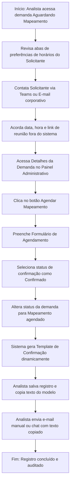

# Fluxo Funcional: Registro de Mapeamento

Este documento especifica o fluxo administrativo interno que realiza a gestão, o agendamento e o controle manual das reuniões técnicas de diagnóstico e levantamento de processos no **Tirador de Pedidos do NEO**.

## 1. Visão Geral do Fluxo

- **Objetivo:** Permitir ao analista registrar de forma centralizada os dados, links, participantes e datas acordadas por fora da ferramenta para as reuniões de mapeamento de processos, fornecendo um controle operacional de atividades.
- **Ator Principal:** Analista.
- **Condição Inicial:** Uma solicitação foi triada como elegível, encontra-se no status de **aguardando mapeamento** e possui um analista responsável formalmente alocado no sistema.

---

## 2. Sequência Principal de Passos

### Detalhamento dos Passos:

1.  **Consulta de Disponibilidade Prévia:** O analista responsável entra na tela de detalhes da demanda no NEO e consulta as 3 opções de preferências de horários enviadas pelo solicitante no formulário.
2.  **Alinhamento Externo de Agenda:** O analista faz contato direto com o solicitante pelos canais de comunicação corporativos tradicionais (Teams ou Outlook) para definir a data exata da reunião.
3.  **Registro de Dados do Agendamento:** Uma vez agendado externamente, o analista abre o modal/seção "Agendar Mapeamento" no NEO e preenche manualmente os seguintes dados cruciais:
    - _Responsável pelo mapeamento:_ (Autopreenchido com o nome do analista ativo, mas editável).
    - _Data do Agendamento:_ (Campo de data).
    - _Horário:_ (Campo de hora de início).
    - _Duração Prevista:_ (Ex: 1 hora, 1h30, 2 horas).
    - _Modalidade:_ (Dropdown contendo Online ou Presencial).
    - _Link da Reunião:_ (Campo texto para URL do Microsoft Teams ou similar, obrigatório se online).
    - _Local:_ (Campo de texto para nome da sala física de reuniões, obrigatório se presencial).
    - _Participantes Previstos:_ (Lista de e-mails ou nomes das pessoas convidadas).
    - _Observações:_ (Campo para notas adicionais de planejamento do mapeamento).
    - _Status da Confirmação:_ (Dropdown contendo Confirmado ou Aguardando confirmação).
4.  **Alteração de Status de Acompanhamento:** O analista salva o formulário de agendamento e muda o status público da demanda na triagem para **Mapeamento agendado**. No momento em que a sessão estiver ocorrendo fisicamente na data registrada, o status pode ser movido para **Em mapeamento**.
5.  **Utilização de Templates de Comunicação Prontos:** Para poupar tempo operacional, o sistema carrega na parte inferior da tela um bloco com **modelos textuais prontos para cópia rápida (clipboard)**.
    - O analista seleciona o template "Confirmação de Agendamento".
    - O sistema autopreenche as variáveis do texto (ex: substitui `[Nome do Solicitante]` pelo nome real, `[Protocolo]`, `[Data]`, `[Link da Reunião]`, etc.).
    - O analista clica em "Copiar Texto".
    - Cola o texto diretamente em sua ferramenta de e-mail corporativo ou chat e envia ao solicitante, encerrando a atividade administrativa.
