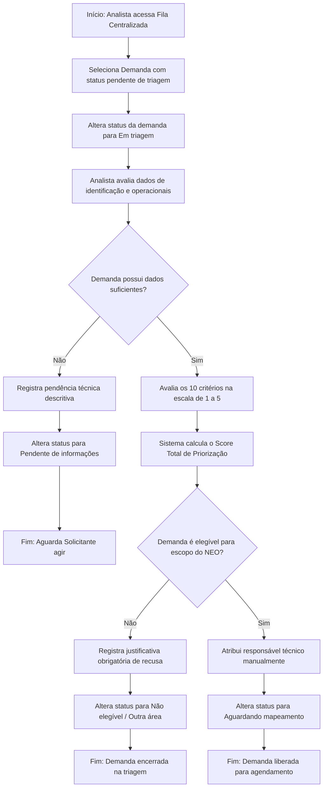

# Fluxo Funcional: Triagem e Priorização

Este documento detalha o fluxo crítico do painel administrativo do **Tirador de Pedidos do NEO** utilizado pela equipe interna para avaliar, classificar, dimensionar a prioridade de atendimento e alocar recursos para cada solicitação recebida.

## 1. Visão Geral do Fluxo

- **Objetivo:** Organizar a fila de demandas entrantes, realizar o cálculo do score numérico de priorização com base em 10 critérios, decidir sobre a elegibilidade e atribuir o responsável técnico pelo mapeamento.
- **Atores Principais:** Analista e Administrador.
- **Condição Inicial:** Novas demandas encontram-se na Fila Centralizada de Pedidos no status de **Solicitação enviada** ou **Aguardando triagem**.

---

## 2. Sequência Principal de Passos

### Detalhamento dos Passos:

1.  **Abertura para Análise:** O analista logado acessa a Fila Centralizada e escolhe a demanda. O status muda para **Em triagem**.
2.  **Análise de Consistência:** O analista faz uma varredura nas abas de identificação e dados operacionais preenchidos pelo solicitante.
3.  **Avaliação dos 10 Critérios de Priorização:** O analista acessa a calculadora em tela e insere notas de **1 a 5** para cada um dos seguintes parâmetros corporativos
    - _Impacto Operacional:_ Dimensão do impacto nas rotinas atuais.
    - _Risco Operacional:_ Vulnerabilidade associada caso não seja feito.
    - _Urgência:_ Necessidade temporal da entrega.
    - _Volumetria:_ Escala transacional do processo.
    - _Esforço Manual:_ Carga de trabalho atual executada na ponta.
    - _Impacto no Cliente:_ Benefício percebido pelo cliente final.
    - _Prazo Regulatório:_ Vinculação a exigências legais.
    - _Áreas Impactadas:_ Quantidade de departamentos que utilizam.
    - _Alinhamento Estratégico:_ Aderência ao plano estratégico da empresa.
    - _Complexidade Estimada:_ Nível técnico percebido da intervenção.
4.  **Cálculo Automático de Score:** O sistema calcula a soma simples ou ponderada dos pontos (variando de 10 a 50 pontos), classificando-a nas faixas de prioridade estabelecidas (Baixa, Média, Alta ou Crítica).
5.  **Definição do Resultado da Triagem (Elegibilidade):** O analista clica na caixa de decisão de elegibilidade e escolhe o desfecho operacional:
    - _Elegível:_ Demanda aprovada para mapeamento. O status avança para **Aguardando mapeamento**.
    - _Não Elegível:_ Demanda rejeitada por não-aderência. **O preenchimento do campo descritivo de justificativa da decisão torna-se obrigatório no sistema**. O status vira **Não elegível**.
    - _Direcionada para Outra Área:_ Demanda fora do escopo do NEO, mas útil a outro núcleo. O analista preenche obrigatoriamente a justificativa e a área destinatária, e o status vira **Direcionado para outra área**.
    - _Duplicada:_ O sistema exige a inserção do protocolo da demanda principal e o status vira **Cancelado**.
6.  **Atribuição Manual do Responsável:** O Analista / Administrador seleciona na lista um dos profissionais ativos cadastrados no banco. A tela do NEO exibe dinamicamente ao lado do nome do profissional a sua carga de trabalho corrente (ex: "Analista João - 4 demandas em andamento") para apoiar o equilíbrio operacional.
7.  **Persistência e Histórico:** O usuário salva as alterações. O sistema persiste os dados e registra uma entrada imutável no Histórico de Auditoria registrando autor, data, hora, os valores anteriores e os novos valores do status, prioridade e responsável.
